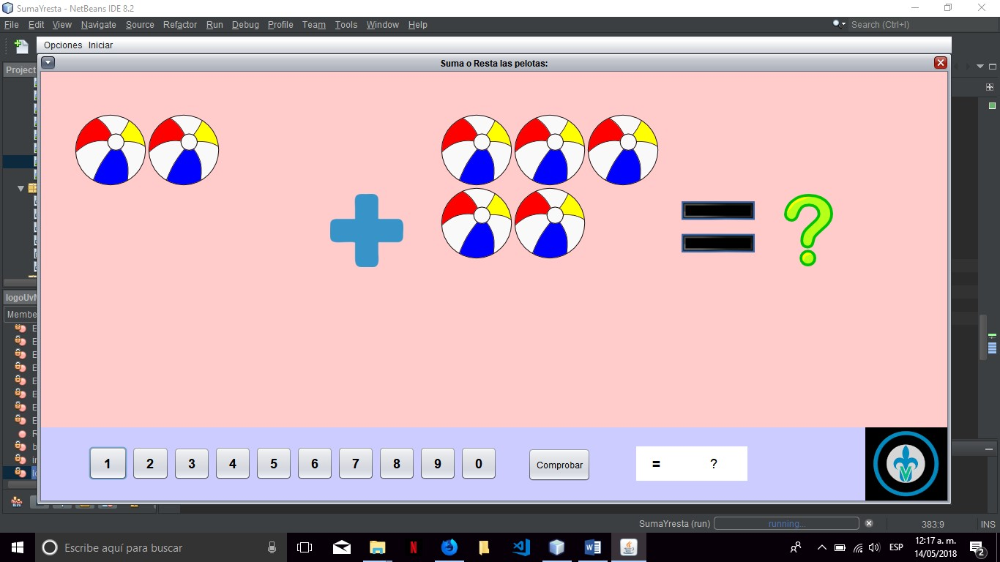

Proyecto didactico: Arit-Básico
===============================

Por: Luis Eduardo Aguirre Fuentes
---------------------------------

Propósito
---------
Mediante este software se pretende mejorar la habilidad de pensamiento matemático en niños de entre 5 y 7 años, en el cual se implementa ciertas imágenes que relacionan la parte cognitiva y lógica del infante, para así mejorar su capacidad para realizar operaciones matemáticas mentalmente.

Explicación de Software
-----------------------
En la primera pantalla se encuentra dos botones superiores que muestran un menú despegable, el primero Opciones muestra un botón SALIR el cual termina la ejecución del programa. Seguido del menú Opciones, está el menú Iniciar, que despliega un botón con el texto Suma y Restar, que abre una ventana interna del programa en donde se hace la principal actividad del software.

Al hacer click en el botón Sumar y Restar se mostrará una ventana interna en donde se podrá visualizar dos grupos de pelotas de manera aleatoria, con un símbolo de más (+) o menos (-) en medio de estos dos grupos, siendo primero más y después menos, y así consecutivamente. 

En la parte inferior se muestra un panel con botones del 0 al 9, seguido de un botón Comprobar que realiza los cálculos para analizar si la respuesta elegida por el usuario es correcta y un cuadro en donde se muestra la solución propuesta por el usuario. 

Y en la esquina inferior derecha se encuentra el logo de la UV.
Si el usuario da la solución correcta se mostrará un mensaje en pantalla felicitándolo por su desempeño, de lo contrario se le notificará que su respuesta es incorrecta, y si el usuario no ingresa algún valor, marcará un error.

Modo prodigio
-------------
En el menú Iniciar existe la opción “Modo prodigio”, el cual exige al usuario aplicar al máximo su habilidad aritmética para resolver las operaciones antes de que el tiempo se acabe

Requerimientos
--------------
-Resolución en ventana 1250x640  
-No compatible en pantalla completa 
-Windows 10 
-2gb RAM mínimo/ 4gb recomendable 
-Procesador Pentium mínimo/Intel Core i3 recomendable 
-2gb de almacenamiento disponible  
-Requiere java instalado en el sistema 

Si deseas descargar el software en formato jar, se encuentra en la siguiente ruta de este repositorio:
SumaYresta/src/imgs/SumaYresta.jar
